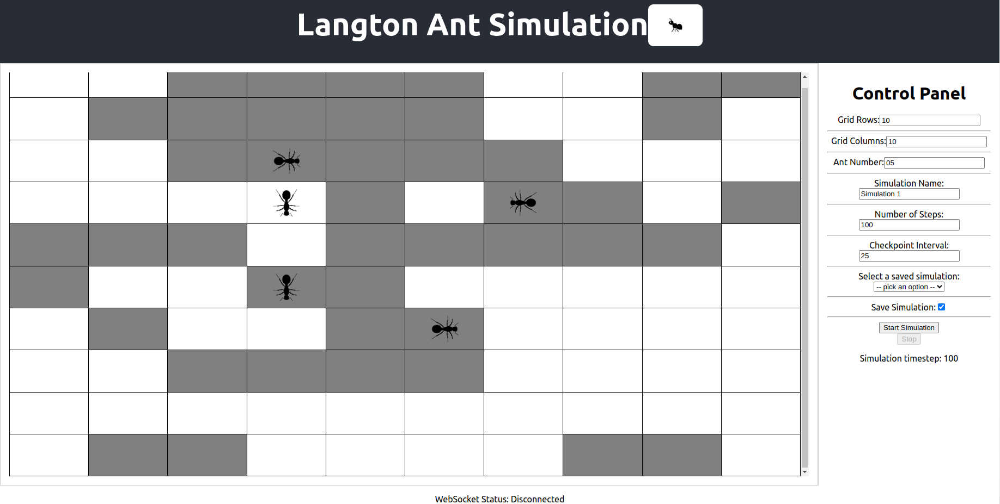
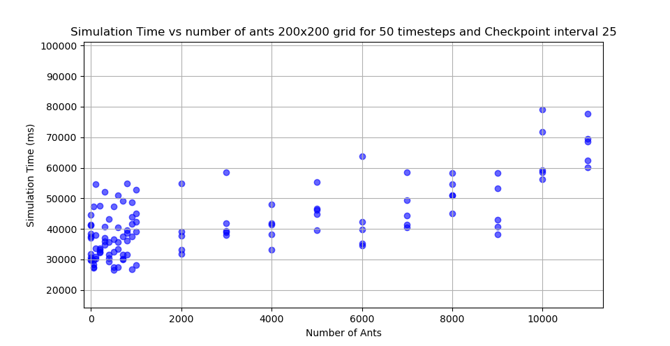
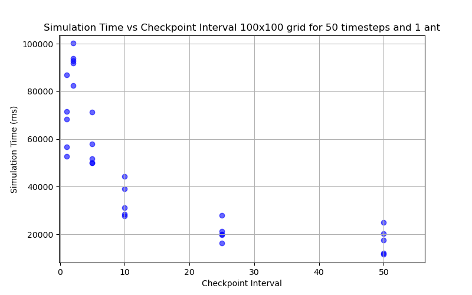

# Scalable computing - Report



## Introduction
Langton's Ant is a simple automation, that allows for measuring algorithmic complexity, through the simple rules that an ant follows, while travesing a grid. Based on the rules defined and the number of steps completed, the ant forms intricate patterns overtime. While the concept is fascinating and it presents some peculiarity being related to the subject of ants, the simulation of multiple Langton Ants traversing both small and large grids could present a great computational challenge. The purpose of this project is to create a scalable framework, capable of simulating multiple ants concurrently, without facing performance bottlenecks with the increase of workload. 

In the context of scalable computing, the project is an attempt at creating a distributed system that is designed to bypass the single point of failure risk when deploying an application on a single node. By deploying the application in a cluster environment using Kubernetes, we aim to ensure that the framework would distribute workloads to resources equally, make it fault tollerant and easily scalable horizontally.

This report will outline our efforts while designing the application, our thought process when tackling every objective of the system design, the actual implementation details as well as thoughts about its limitations and future work.

## Project Overview

<!-- Explain the general outline of the project and how we tackled it -->

<!-- Explain core functionality; what can be done through our app -->


The architecture of the Langton Ant simulator emerged from multiple discussions on how to adhere to the course requirments, while managing time constraints as well as performance and scalability constraints.

We provisioned three nodes - one master and two worker nodes on HCP's Bateleur cloud, taking up enough resources for our application to perform accordingly while staying under our quouta for the course. We decided to use Terraform for templating our infrastructure, so that we find it easier to provision the necessary machines in a reproducible and easily reconfigurable way. This decision was mainly motivated by the course's requirement for the application to run on a cloud environment. We adopted Kubernetes (K3s) for deployment and lifecycle management, as it represents the industry-standard method for orchestrating applications in cluster environments. 

The core simulation logic we devoted to Apache Spark for its native MapReduce capabilities, which aligns with project's requirements for parralel computation. For providing parameters to the simulator as well as serving the simulation to the frontend, we chose FastAPI for the backend. Additionally, Kafka was integrated to decouple the backend from the simulator and enable fault-tolerant communication. 

The React frontend communicates with the backend via WebSocket, enabling real-time grid updates. Users interact with an adjustable grid, modifying parameters like size and ant count, while a control panel allows starting, pausing, or saving simulations. Saved states are persisted for historical analysis, and a step counter provides live progress tracking. The resulting visualizations highlight emerging patterns as ants traverse the grid, demonstrating complex behavior using simple rules.


<!-- ## Usage? -->

## Data pipelines

### Streaming data 

<!-- #Robin? -->

1. Frontend makes a job request over HTTP.
2. Backend passes this job request on to a kafka topic.
3. Simulator reads jobs from this kafka topic.
4. Simulator processes the job.
5. Simulator continuous produces updates of the job onto a seperate kafka topic.
6. The backend reads from this kafka topic and groups messages together before passing them to the frontend and possibly also mongoDB.
<!-- Include pipeline figure if you can -->

### Historical data 
<!-- #Carmen -->

1. Frontend signals the backend to save the ensuing simulation.
2. Backend reads the simulation updates from the kafka topic and saves them to the MongoDB database.
3. Frontend queries the backend for historical data.
4. Backend queries the MongoDB database for the requested simulation.
5. Backend returns the requested simulation to the frontend.
6. Frontend displays the requested simulation to the user.

<!-- Include pipeline figure if you can -->


## Infrastructure Setup

### Simulation

The simulation logic is computed using Apache Spark. Spark is a scalable in-memory fault-tolerant distributed data processing framework running on the JVM. These properties are achieved in spark using the core underlying data structure called [Resillient Distributed Datasets (RDDs)](https://spark.apache.org/docs/3.5.5/rdd-programming-guide.html). For our simulation we configure spark using the Scala programming language.

One can perform computation on RDDs through transformations (e.g. map and reduce) that produce new RDDs. Transformations are lazily evaluated. This means that RDDs may be in an unmaterialised state where they only store a reference to some initial RDD and the transformations required to produce itself when required. This list of transformations is known as the RDD's "lineage".

Spark, when running in a Kubernetes cluster, has two kinds of pods: one driver and multiple executors. The driver runs our user code and tells the executors which transformations to perform on the partitions of the RDD that they hold.

RDDs are considered quite low-level abstractions. It is recommended to implement application logic in one of the higher-level APIs provided in Spark. Our simulation is implemented using the [GraphX](https://spark.apache.org/docs/latest/graphx-programming-guide.html) module. We model the Cartesian grid as a directed graph where every cell is a vertex and they are connected to their 4 nearest neighbours such that all vertices have an in- and out-degree of 4. This approach makes expressing the logic of the iterative Langton-Ants algorthim quite a simple Pregel operation, in-principle handing the implementation details for scalability, fault tolerance and data locality over to Spark.

The Pregel operator requires us to define three functions: the vertex program `vprog`,`sendMsg`, `mergeMsg`. At each iteration the sendMsg operation is called for every "active" edge, it produces cell updates for either of the vertexes of the input edge. Cells that recieve multiple cell updates merge them into one using the `mergeMsg` function. Finally, cells are updated as defined by vertex program.

### Kafka

We setup 3 kafka pods.

### Backend 
<!-- #Carmen -->

The backend is a core structural component for the application, responsible for accumulating, aggregating and serving data to the frontend. For its implementation, we have chosen the FastAPI framework, which is a Python, modern, fast, high-performance web framework for building APIs. FastAPI is an ideal choice for this application as it is an asynchronous framework that can handle a vast number of requests concurrently. The backend makes use of a websocket for streaming data in real-time to the frontend.

The backend is responsible for several tasks, including:
- Communicating with the simulation in order to signal the start/stop actions, as well as transmitting the simulation parameters.
- Fetching data from the Kafka topic `langton_ant_updates`, aggregating said results and  sending then to the frontend.
- Save historical data to the database if the user requests it.
- Query the database for historical data and serve it to the frontend.

### Frontend 
<!-- #Carmen -->

The frontend represents the first point of access for the user to interact with the application. It displays the state of the simulation in real-time, as well as offering a set of controls to manipulate the simulation. This component has been implemented using React, a JavaScript library for constructing responsive and dynamic user interfaces. This design choice comes naturally as React enables the utilisation of reusable components for fast rendering of real-time updates of the state of the simulation, as well as providing native intergration for websocket communication with the backend.

We have designed the user interface with a focus on simplicity and intuitive interaction. The user may modify the parameters of the simulation, consisting of the grid size (rows and columns), the number of ants, the name of the simulation(relevant for the eventual save), the number of timesteps to be performed by the simulation and the interval in which to perform checkpoints. Furthermore, the user can save the current simulation by marking the `Save Simulation` checkbox. Naturally, the user can opt for visualizing a previous simulation by selecting an entry from the dropdown menu.


### Database 
<!-- #Carmen -->

The application is connected to a MongoDB database, which is a NoSQL database that stores data in flexible, JSON format documents. This component is utilized for storing historical data, represented by previously computed simulations. 

The backend orchestrates the interaction with the database, which includes:
- Saving the current simulation to the database if the user requests it.
- Querying the database for historical data and serving it to the frontend.

Each individual simulation is stored as a document containing the suite of computed individual time steps. Each time step is represented as a JSON document with the following structure:
```json
{
    "simulation_id": <simulation_id>,
    "simulation_name": "Simulation 1",
	"time": 9,
    "cells": [
        {
	    	"colour": true,
	    	"ants": [
	    		{
	    			"direction": "South"
	    		},
	    	],
	    	"rowInd" : 2,
	    	"colInd" : 0,
        }
    ]
}
```

Each time step is indexed by the field `simulation_id`, which is a unique auto-generated identifier for a particular simulation. The `simulation_name` field can be specifed by the user through the frontend, otherwise it is given a generic `Simulation <index>` name. The `time` field represents the current time step of the simulation. The `cells` field contains the list of grid modifications compared to the previous time step. Each cell is defined by its position in the grid, marked by the `rowInd` and `colInd` fields, its colour through the `colour` field (`true` for white, `false` for black) and the list of ants, denoted as`ants`, and their directions in the cell.


### Kubernetes cluster 
<!-- Discuss ingress and overall cluster communication -->

<!-- #Carmen -->
The application is deployed on a Kubernetes cluster, which is a container orchestration platform that automates the deployment, scaling and management of containerized applications. The cluster is composed of four nodes, one master node and three worker nodes. The master node is responsible for managing the cluster and scheduling the pods, while the worker nodes run the actual application pods with the asssociated services.

The application is deployed using K3s, a lightweight Kubernetes distribution that is easy to install and manage. The application is exposed to the outside world through an ingress controller, which routes incoming traffic to the appropriate service based on the request URL.

The principal services consisting of `backend`, `frontend`, `kafka` and `simulator` are deployed through Helm charts, which are packages of pre-configured Kubernetes resources. These charts define the necessary resources for each service, including deployments, services, environment variables. 

### Terraform deployment
 <!-- #Carmen -->

<!-- Discuss deployment -->

The infrastructure is provisioned using Terraform, an open-source infrastructure as code (IaC) tool that allows for the creation and management of cloud resources. The Terraform configuration files define the necessary resources for the application, including the Kubernetes cluster, the nodes and the network configuration. The configuration files are written in HashiCorp Configuration Language (HCL), which is a declarative language that allows for the definition of cloud resources in a human-readable format. 


## Scalability considerations

### Scalability
<!-- Robin -->
Performance measurements demonstrating the horizonatal and vertical scalablility of the solution are work in progress. 

Preliminary results: The simulation for a single ant is multiple orders of magnitude slower using the delivered infrastructure than a reasonable single node implementation provided that a node with the prerequisite.  

<!-- discuss horizontal/vertical scaling -->

### Fault tolerance
<!-- Robin -->

Fault tolerance is handled in Spark via 2 seperate mechanisms. As described above, RDDs have a lineage. If one of the executors fails, spark will automatically recreate its state by recomputing the state from this lineage. In an algorithm with many iterations this mechanism slowly fills up the available memory leading to a heap-overflow. To solve this problem we also use checkpointing. Checkpointing allows spark to trim the lineage. After some constant number of iterations, the entire state of the simulation is stored to a resillient data store. We self-host a resillient data store which can be interfaced with as an S3 bucket interface using [MinIO](https://min.io/). We choose this solution because [Spark and S3 has good support](https://hadoop.apache.org/docs/r3.4.1/hadoop-aws/tools/hadoop-aws/index.html). MinIO achieves resillient data storage through data replication. Checkpointing proves to be a major performance bottleneck. Spark periodically writes checkpoints to this bucket and clears it after the process is done.

### Data locality awareness
<!-- Robin -->

For the computation of the simulation, Spark provides data locality aware processing. Transformations perform computations preferably at a `PROCESS_LOCAL` locality, i.e performing the [calculation on the same JVM where the data is located](https://spark.apache.org/docs/latest/tuning.html#data-locality).

We achieve data locality awareness when sending simulation updates to kafka by specifiying a partition key. (NOTE: This is not yet implement)

### Containerization 
<!-- #Carmen -->

One principle which constitutes an essential building block of the design of the system architecture is containerization. This practice promotes component isolation and encapsulation, which leverages portability and scalable deployment. The core components of the application, composed of the backend, frontend, simulation etc., are encapsulated using Docker. In this manner, each component is self-contained, allowing seamless deployment and scaling across multiple environemnts. 

<!-- ### Load balancing -->

<!-- ### Sharding - #Carmen if we manage to implement it I guess -->


## Performance evaluation 
<!-- #Robin -->
Performance measurements are a work in progress. Preliminary results:

The simulation seems to be heavily IO bottlenecked. Spark introduces high overhead per iteration. The shuffle seems to take up a large proportion of the computation time. We expect our solution to only be "better" than a reasonable single threaded implementation in cases where computing a single iteration requires "enough" time. I.e with a very high number of ants.

From a pure algorithmic complexity analysis, we would expect increasing the number of ants by a factor $n$ should increase the computation time by a factor $n$.

In measurements, we do not see this relation ship at all, we see that increasing the number of ants by multiple orders of magnitudes increases the simulation time by less than a factor of 2. This seems to suggest a heavily IO bottlenecked.



Additionally, we find that checkpointing is a very expensive operation. Ideally, one should checkpoint as infrequently without running out of memory.




## Limitations and future work

<!-- Could discuss challenges as well. -->


## Conclusion

<!-- ## Contributions? -->

<!-- We need an evidence metric that everyone contributed equally in order to get 0.5 extra points but idk if it needs to me mentioned in the report. -->
